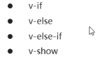

# Day01

## 1. Vue概述

### 1.1 作者


- 我们课程中使用的vue版本是v2.5.17 

### 1.2 介绍

- 介绍PPT截图如下：


- 框架：vue就是一个框架，提供了很多基础性服务，比如虚拟DOM技术，双向绑定技术
  - 框架则是为解决一个(一类)问题而开发的产品 （是一个解决方案）
  - 使用框架就不一样，我们好像被它控制着，要使用它，就得听它的，按照它的规则来，即使它某些地方我们用不到，或者不喜欢，也不能说什么。 
- 库：jquery就是一个库，提供了很多api（工具：函数，属性）
  - 库是将代码集合成的一个产品，供程序员调用
  - 使用库的时候我们比较随意，想用哪取哪，哪块好用哪，而且把它拿过来可以按照我们的编写意愿来用
- 其实，也可以将库和框架都理解成**工具**，程序员使用这些工具，可以更快捷开始
- **渐进式**：
  - Vue提供了一系列的技术，我们可以**选择一个或多个，甚至使用全部**，这就是渐进式。
    - **就是说，可以渐渐的，一点一点的去使用这个框架**
  - 渐进式，是从vue的使用方式去理解的：
    - 你可以在原有大系统的上面，把一两个组件改用它实现，当jQuery用
    - 也可以整个用它全家桶开发，当Angular用
    - 还可以用它的视图，搭配你自己设计的整个下层用
    - 你可以在底层数据逻辑的地方用OO和设计模式的那套理念
    - 也可以函数式，都可以
- 官网：<https://cn.vuejs.org/v2/guide/> 

## 2. Vue基本使用 ***

> 02-Vue之HelloWorld.avi

- 传统

  

  - 原生js：代码复杂，使用起来非常繁琐
  - Jquery：代码简单，使用起来已经非常轻松
  - 但是虽然Jquery已经非常简洁，但是Vue可以更加简洁

- Vue

  -  vue的基本使用步骤

    1. 引入vue.js库文件
    2. 实例化Vue对象，添加el和data选项
    3. 添加Vue要操控的标签，一般是一个id为app的div
    4. 将标签与Vue进行绑定
    5. data中添加数据
    6. 通过插值表达式显示数据

  - 示例

    

- 具体代码：01-Vue基本使用.html

  ```html
  <!DOCTYPE html>
  <html lang="en">

  <head>
      <meta charset="UTF-8">
      <meta name="viewport" content="width=device-width, initial-scale=1.0">
      <meta http-equiv="X-UA-Compatible" content="ie=edge">
      <title>Document</title>
  </head>

  <body>
      <!-- Vue的基本使用步骤
                	1. 引入vue.js库文件
                  2. 实例化Vue对象，添加el和data选项
                  3. 添加Vue要操控的标签，一般是一个id为app的div
                  4. 将标签与Vue进行绑定
                  5. data中添加数据
                  6. 通过插值表达式显示数据 -->
      <div id="app">
          {{msg}}
      </div>
      <script src="./js/vue.js"></script>
      <script>
          var vue = new Vue({
              el: '#app',
              data: {
                  msg: 'Hello Vue'
              }

          });
      </script>

  </body>

  </html>
  ```

- 效果

  

- 解释

  

  - 挂载，理解为**关联**。我们需要将数据与某个元素进行关联，只有关联了，元素内才能使用这个数据

  - el：element缩写，指定一个vue关联的元素

  - el的值：一般用选择器，多数使用**ID选择器**

  - 插值表达式：插入数值，**用于显示/计算data中的数据**

  - 插值表达式中可以计算：

    

  - vue代码是经过vue框架编译（翻译）为原生js代码


## 3. Vue模板语法

### 3.1 渲染

> 03-模板语法概述.avi

- Vue的模板就是为了处理前端渲染

- 如何渲染

  

  - 渲染：就是把数据填充到HTML标签中

- 渲染方式

  

- 方式1：原生js


- 方式2：模板引擎

  

  - art模板需要通过js获取dom，然后通过js绑定事件

### 3.2 Vue模板语法

> 04-指令概念与v-cloak指令用法.avi

- 第三种方式就是使用vue模板
- 我们先来了解一下vue模板语法


#### 3.2.1 指令

- 什么是指令 ***
  - 什么是自定义属性 ：自己给标签添加的属性，一般以data-开头
  - **指令的本质就是自定义属性** 
  - 指令的格式：以v-开始（比如：v-model） 
    - v：vue的首字母
    - 所以看到v-xxx属性，都是vue中的指令

#### 3.2.2 数据响应式

##### 3.2.2.1 响应式

- 如何理解响应式

  - html5中的响应式：屏幕尺寸的变化到样式变化
  - 数据的响应式：数据变化到中页面内容变化

- 响应式：你变化，我跟着变化（数据变化，界面跟着变化）

  

- 数据绑定：将数据填充到标签中

  - 数据绑定默认就是响应式的
  - 插值表达式就是数据绑定


#### 3.2.3 双向数据绑定 ***

- 什么是双向数据绑定

  - 首先存在双方：一方是界面中显示的数据，另一方是vue中的数据
  - vue中的数据变化，显示的数据跟着变化
  - 显示的数据变化，vue中的数据跟着变化

  

  - 双向数据绑定，一般用于有与用户交互的控件，比如表单的控件：文本框

- v-model

  - 通过v-model可以实现双向绑定
  - 语法如下：msg是vue的data中的数据

  ```html
  <input type="text" v-model='msg'>
  ```

  - 这样就实现了，text这个文本框输入框与msg双向绑定
  - 相当于文本框的value属性与数据属性msg进行了双向绑定
    - value改变会影响msg
    - msg改变会影响value

- 具体代码：02-双向数据绑定.html

  ```html
  <!DOCTYPE html>
  <html lang="en">
  <head>
      <meta charset="UTF-8">
      <meta name="viewport" content="width=device-width, initial-scale=1.0">
      <meta http-equiv="X-UA-Compatible" content="ie=edge">
      <title>Document</title>
  </head>
  <body>
       /*
          双向数据绑定
          1、从页面到数据
          2、从数据到页面
        */
      <div id="app">
          <input type="text" v-model="msg">

      </div>
      <script src="./js/vue.js"></script>
      <script>
          var vue = new Vue({
              el: '#app',
              data: {
                  msg: '我是文本框的初始内容'
              }
          });
      </script>
  </body>
  </html>
  ```

- 效果

  

#### 3.2.4 MVVM

- 介绍：双向绑定基于MVVM设计思想。

  

- 图示：

  

  - 视图到模型：采用监听的方式，视图监听数据的变化
  - 模型到视图：采用绑定的方式，模型数据渲染到视图中
    - 数据绑定：插值表达式就是数据绑定

### 3.3 事件绑定

#### 3.3.1 事件绑定介绍 ***

- Vue如何处理事件

  

  - click：是事件名

  - ‘’引号内：可以写表达式，也可以写函数调用

    

    - 加不加括号的区别，是否能够传参

- 代码

  ```html
  <!DOCTYPE html>
  <html lang="en">

  <head>
      <meta charset="UTF-8">
      <meta name="viewport" content="width=device-width, initial-scale=1.0">
      <meta http-equiv="X-UA-Compatible" content="ie=edge">
      <title>Document</title>
  </head>

  <body>
      <div id="app">
          {{num}}
          <input type="button" value="按钮" v-on:click="num++">
          <input type="button" value="按钮" v-on:click="handle">
      </div>
      <script src="./js/vue.js"></script>
      <script>    
          var vue = new Vue({
              el: '#app',
              data: {
                  num: 0
              },
              methods: {
                  handle: function () {
                      //函数中使用data数据，需要加上this，this代表的是vue实例对象
                      this.num++;
                  }
              }
          });

      </script>
  </body>

  </html>
  ```

#### 3.3.2 事件函数传参 ***

- 介绍

  

  - 1、如果事件直接绑定函数名称，那么默认系统会传递事件对象作为事件函数的第一个参数
  - 2、如果事件绑定函数调用，那么事件对象必须作为最后一个参数显示传递，并且事件对象的名称必须是$event 
    -  **其实传参的顺序是可以调整的，$event不一定非得是最后传递**
  - 说明：$event是事件对象
    - 只要是事件发生，就会有事件对象，之前js是通过event/e表示，在vue中是$event
    - event.target：获取到当前的事件源对象，发生事件的元素对象

- 代码：04-事件绑定-传参.html

  ```html
  <!DOCTYPE html>
  <html lang="en">

  <head>
      <meta charset="UTF-8">
      <meta name="viewport" content="width=device-width, initial-scale=1.0">
      <meta http-equiv="X-UA-Compatible" content="ie=edge">
      <title>Document</title>
  </head>

  <body>
      <!-- - 1、如果事件直接绑定函数名称，那么默认会传递事件对象作为事件函数的第一个参数
  -          2、如果事件绑定函数调用，那么事件对象必须作为最后一个参数显示传递，并且事件对象的名称必须是$event 
   -->
      <div id="app">
          {{num}}
          <input type="button" value="按钮1" @click="handle1">
          <input type="button" value="按钮2" @click="handle2($event,3)">

      </div>
      <script src="./js/vue.js"></script>
      <script>
          var vue = new Vue({
              el: '#app',
              data: {
                  num: 0
              },
              methods: {
                  handle1: function (event) {
                      this.num++;
                      console.log(event);

                  },
                  handle2: function (event, addNum) {
                      this.num = this.num + addNum;
                      console.log(event);

                  }
              }
          });
      </script>

  </body>

  </html>
  ```


#### 3.3.3 计算器案例

- 需求：

  

- 分析：

  

- **问题**：这里的俩文本框，为啥需要双向绑定？

  - 数据绑定有单向的：数据填充指令
  - 也有双向的：v-model
  - 因为用户输入内容之后，我们的数据也需要跟着变化，这样才能知道用户输入的数据从而计算
  - 而数据填充指令，只是数据影响文本框而已

- 代码：05-简易计算器.html

  ```html
  <body>
    <div id="app">
      <h1>简单计算器</h1>
      <div>
        <span>数值A:</span>
        <span>
          <input type="text" v-model='a'><!-- 文本表单，需要用双向绑定 -->
        </span>
      </div>
      <div>
        <span>数值B:</span>
        <span>
          <input type="text" v-model='b'><!-- 文本表单，需要用双向绑定 -->
        </span>
      </div>
      <div>
        <button v-on:click='handle'>计算</button>
      </div>
      <div>
        <span>计算结果:</span>
        <span v-text='result'></span>
      </div>
    </div>
    <script type="text/javascript" src="js/vue.js"></script>
    <script type="text/javascript">
      /*
        简单计算器案例 
      */
      var vm = new Vue({
        el: '#app',
        data: {
          a: '',//默认值空字符串
          b: '',
          result: ''
        },
        methods: {
          handle: function(){
            // 实现计算逻辑
            this.result = parseInt(this.a) + parseInt(this.b);
          }
        }
      });
    </script>
  </body>
  ```


### 3.4 属性绑定 ***

#### 3.4.1 属性绑定介绍

- 之前我们有很多时候，是需要操作DOM中的属性的

  - 原生js：setAttribute，getAttribute
  - jquery：attr()

- vue如何处理属性：属性绑定

  

- 属性绑定，就是**将元素的属性值与数据绑定起来**

  - 绑定之后，数据发生变化之后，元素的属性值跟着一起变化
  - 想要修改属性值，那么就修改数据属性即可
  - 想要获取属性值，那么就直接获取数据属性即可
  - 元素的属性值，很多时候都是动态的，要根据后台返回的数据来变化的，这时候就需要使用属性绑定

- 代码：06-属性绑定.html

  ```html
  <body>
    <div id="app">
      <a v-bind:href="url">百度</a>
      <a :href="url">百度1</a><!-- href与url进行绑定 -->
      <button v-on:click='handle'>切换</button><!--点击按钮之后，修改url，那么a的href属性值跟着一起变化 -->
    </div>
    <script type="text/javascript" src="js/vue.js"></script>
    <script type="text/javascript">
      /*
        属性绑定
      */
      var vm = new Vue({
        el: '#app',
        data: {
          url: 'http://www.baidu.com'
        },
        methods: {
          handle: function(){
            // 修改URL地址
            this.url = 'http://www.itcast.cn';
          }
        }
      });
    </script>
  </body>
  ```

### 3.5 分支循环结构  ***

#### 3.5.1 分支结构

- 介绍

  

  - v-if，v-else-if与v-show的条件，与之前的if条件语法一致
    - 比如逻辑运算符：&&，||，！
    - 比较运算符：>，<，>=，<=，==，!=

- 区别：

  

  - if条件如果不满足，就不会渲染到界面上，DOM结构上没有，页面上也没有显示
  - show条件如果不满足，Dom结构上有，但是样式为display：none，页面不显示
  - 再理解：
    - v-if如果不满足条件，这个元素就直接不存在 
    - v-show如果不满足条件，这个元素是存在的，只不过看不见 

- 代码：

  ```html

  <body>
    <div id="app">
      <div v-if='score>=90'>优秀</div>
      <div v-else-if='score>=80'>良好</div>
      <div v-else-if='score>60'>一般</div>
      <div v-else>比较差</div>
      <div v-show='flag'>看得见我么</div>
      <button v-on:click='handle'>点击</button>
    </div>
    <script type="text/javascript" src="js/vue.js"></script>
    <script type="text/javascript">
      /*
        分支结构
        v-show的原理：控制元素样式是否显示 display:none
      */
      var vm = new Vue({
        el: '#app',
        data: {
          score: 10,
          flag: false
        },
        methods: {
          handle: function(){
            this.flag = !this.flag;
          }
        }
      });
    </script>
  </body>
  ```

#### 3.5.2 循环结构

##### 1. 循环数组

- 介绍：

  

  - item是数组中的每一项(值)，index是数组中的索引

    - item数组的value，index是数组的key
    - 顺序不能颠倒，一个是value，第二个是key
    - 变量名item，index可以改，但是顺序是固定的

  - :key是v-bind:key的简写

  - 只要是遍历li，就添加key属性的绑定，绑定的值是唯一值

  - 如果item没有id属性，那就用index即可

  - key的官网介绍：

    

    - 这个其实对于我们程序员来说没有用
    - 只是vue内部在执行v-for的时候会看我们指定没指定key，如果指定了那么有助于vue的性能提升

- 代码：

  ```html
  <body>
    <div id="app">
      <div>水果列表</div>
      <ul>
        <li v-for='item in fruits'>{{item}}</li>
        <li v-for='(item, index) in fruits'>{{item + '---' + index}}</li>
        <li :key='item.id' v-for='(item, index) in myFruits'>
          <span>{{item.ename}}</span>
          <span>-----</span>
          <span>{{item.cname}}</span>
        </li>

      </ul>
    </div>
    <script type="text/javascript" src="js/vue.js"></script>
    <script type="text/javascript">
      /*
        循环结构-遍历数组
      */
      var vm = new Vue({
        el: '#app',
        data: {
          fruits: ['apple', 'orange', 'banana'],
          myFruits: [{
            id: 1,
            ename: 'apple',
            cname: '苹果'
          },{
            id: 2,
            ename: 'orange',
            cname: '橘子'
          },{
            id: 3,
            ename: 'banana',
            cname: '香蕉'
          }]
        }
      });
    </script>
  </body>
  ```

##### 2. 循环对象

- 介绍

  

  - value是对象的属性值，key是对象的属性名，index为遍历的索引（遍历的第几次，从0开始）
    - 顺序不能颠倒，一个是value，第二个是key，第二个是index
    - 变量名value，key，index可以改，但是顺序是固定的
  - v-if与v-for结合使用
    - v-if中的条件表达式，可以使用value，key，index进行判断
    - 结合之后的逻辑为：遍历object，当value为12时，才显示当前div

- 代码

  ```html
  <body>
    <div id="app">
      <!--当obj中某个属性的值为13时，才会显示这个div。obj中的age属性值为13，所以显示了这个div，并且内容是age的相关内容-->
      <div v-if='v==13' v-for='(v,k,i) in obj'>{{v + '---' + k + '---' + i}}</div>
    </div>
    <script type="text/javascript" src="js/vue.js"></script>
    <script type="text/javascript">
      // 使用原生js遍历对象
      var obj = {
        uname: 'lisi',
        age: 12,
        gender: 'male'
      }
      for(var key in obj) {
        console.log(key, obj[key])
      }
      /*
        循环结构
      */
      var vm = new Vue({
        el: '#app',
        data: {
          obj: {
            uname: 'zhangsan',
            age: 13,
            gender: 'female'
          }
        }
      });
    </script>
  </body>
  ```

##### 3. 循环总结

- 循环语法：

  - 不管是循环数组还是对象语法都是： v-for='(value,key) in xxx'
    - 数组的value：数组中的每一项，数组的key：数组的索引
    - 对象的value：属性值，对象的key：属性名
  - 只不过循环对象的时候，多一个index，循环的索引 ：v-for='(value,key,index) in xxx'

- 例子

  ```html
  <li v-for='(value, key) in fruits'>{{item + '---' + index}}</li>
  <div v-for='(value,key,index) in obj'>{{v + '---' + k + '---' + i}}</div>

  var vm = new Vue({
        el: '#app',
        data: {
   	    fruits: ['apple', 'orange', 'banana'],
          obj: {
            uname: 'zhangsan',
            age: 13,
            gender: 'female'
          }
        }
      });
  ```


## 4. Vue常用特性

- 常用特性如下：

  - 计算属性：跟methods的方法类似，但是也有特殊之处
  - 过滤器：用于格式化数据
  - 生命周期：Vue实例从创建到销毁的整个过程

### 4.1 计算属性 ***

#### 4.1.1 介绍

- 为啥需要计算属性


- 如下：插值表达式中，计算逻辑比较复杂（**将msg内容反转**）


- 计算属性用法：

  

  - computed：计算的
  - 书写位置：与methods，data同级
  - 里边定义的reversedMessage就是计算属性名，后边跟上一个匿名函数
  - 有同学说，这不是一个方法么，这是因为计算属性在用的时候当属性用，所以虽然是方法，但是叫计算属性

- 代码：

  ```html
  <body>
    <div id="app">
      <div>{{msg}}</div>
      <!--计算属性与data属性用法一致，可以直接放入插值表达式中（系统内部会加括号调用计算属性）-->
      <div>{{reverseString}}</div>
    </div>
    <script type="text/javascript" src="js/vue.js"></script>
    <script type="text/javascript">
      /*
        计算属性
      */
      var vm = new Vue({
        el: '#app',
        data: {
          msg: 'Nihao'
        },
        computed: {
          reverseString: function(){
            return this.msg.split('').reverse().join('');
            // ['N','i','h','a','o']
            // ['o','a','h','i','N']
            //'oahiN'
          }
        }
      });
    </script>
  </body>
  ```

#### 4.1.2 计算属性与方法区别

- 区别

  

  ​

  - 第一个区别：方法不存在缓存
  - 第二个区别：方法在插值表达式中调用必须添加小括号

- 计算属性演示：

  

  - 计算属性使用了两次，而控制台只打印了一次computed。这是因为第一次使用之后，将结果放入了缓存，第二次直接使用缓存即可。
  - 所以我们一般把**计算**比较复杂的逻辑，放入**计算**属性中，以提高效率
  - 而方法就是处理一些普通的逻辑

- 方法演示：

  ```html
  <body>
    <div id="app">
      <div>{{reverseString}}</div>
      <div>{{reverseString}}</div>
        <!--方法调用两次，控制台输出两次methods，说明方法没有缓存-->
      <div>{{reverseMessage()}}</div>
      <div>{{reverseMessage()}}</div>
      <!--注意：计算属性不需要添加下括号，方法需要添加小括号调用-->
    </div>
    <script type="text/javascript" src="js/vue.js"></script>
    <script type="text/javascript">
      /*
        计算属性与方法的区别:计算属性是基于依赖进行缓存的，而方法不缓存
      */
      var vm = new Vue({
        el: '#app',
        data: {
          msg: 'Nihao',
          num: 100
        },
        methods: {
          reverseMessage: function(){
            console.log('methods')
            return this.msg.split('').reverse().join('');
          }
        },
        computed: {
          reverseString: function(){
            console.log('computed')
            // return this.msg.split('').reverse().join('');
            //除了上边的计算，还可以处理for循环，依然是会缓存
            var total = 0;
            for(var i=0;i<=this.num;i++){
              total += i;
            }
            return total;
          }
        }
      });
    </script>
  </body>
  ```

  - 基于**依赖**缓存，其实是**基于依赖的数据进行缓存**，比如上边的msg改变了，那么肯定会重新执行一次，再缓存

  - **总结**：大家需要记忆的是这个总结

    - 计算属性会缓存，方法不会
    - 如果计算属性中使用的data属性发生改变，计算属性会重新缓存

### 4.2 过滤器 ***

- 介绍

  

- 定义

  - 全局的过滤器

    

    - 过滤器一般是将数据属性的值进行格式化，所以使用格式：**data属性 | 过滤器名称**
    - value就是使用过滤器的data属性值
    - **将格式化之后的数据，通过return返回**

  - 局部过滤器：

    

    - 定义位置与methods一致
    - capitalize是过滤器名称，function也需要一个参数，也需要返回值

- 使用

  

- 代码：10-过滤器.html

  ```html
  <!DOCTYPE html>
  <html lang="en">

  <head>
      <meta charset="UTF-8">
      <meta name="viewport" content="width=device-width, initial-scale=1.0">
      <meta http-equiv="X-UA-Compatible" content="ie=edge">
      <title>Document</title>
  </head>

  <body>
      <div id="app">
          <div>{{msg|upper}}</div>
          <div>{{msg1|lower}}</div>
          <!-- 级联使用 -->
          <div>{{msg1|lower|upper}}</div>
          <!-- 属性绑定使用 -->
          <div :id="msg1|lower|upper">123</div>

      </div>
      <script src="./js/vue.js"></script>
      <script>
          Vue.filter('lower', function (val) {
              return val.charAt(0).toLowerCase() + val.slice(1);
          });
          var vue = new Vue({
              el: '#app',
              data: {
                  msg: 'hello',
                  msg1: 'Hello'
              },
              methods: {

              },
              computed: {

              },
              filters: {
                  upper: function (val) {
                      return val.charAt(0).toUpperCase() + val.slice(1);
                  }
              }
          });
      </script>
  </body>

  </html>
  ```

- 案例：11-日期格式化过滤器.html

  ```html
  <!DOCTYPE html>
  <html lang="en">

  <head>
      <meta charset="UTF-8">
      <meta name="viewport" content="width=device-width, initial-scale=1.0">
      <meta http-equiv="X-UA-Compatible" content="ie=edge">
      <title>Document</title>
  </head>

  <body>
      <div id="app">
          <div>{{d|dateFormat}}</div>
            </div>
    <script src="./js/vue.js"></script>
    <script>
        Vue.filter('dateFormat', function (val) {
            //   拿到时间戳之后转换成年月日 
            var time = new Date(val)
            console.log(time)
            var y = time.getFullYear()
            //  月的取值 是  0  - 11
            var m = time.getMonth() + 1

            var d = time.getDate()
                      return y + '年  ' + m + '月  ' + d + '号'
        });
        var vue = new Vue({
            el: '#app',
            data: {
                d: '2020-12-19'
            },
            methods: {

            },
            computed: {

            }
        });
    </script>
      </body>
    </html>
  ```


### 4.3 生命周期

- Vue实例的生命周期：Vue实例从创建到销毁的整个过程。
- 生命周期介绍：


- 生命周期图图

  

- vue实例生产过程

  

  - 生命周期中的每一步，其实都是一个函数
  - 他们会在不同时机被系统调用
  - 生命周期函数定义的位置与methods一致

- 案例需求：

  - 界面显示数据msg
  - 一个按钮更新msg的值，观察声明周期函数的执行
  - 一个按钮销毁Vue实例，观察声明周期函数的执行

- 代码：

  ```html
  <body>
    <div id="app">
      <div>{{msg}}</div>
      <button @click='update'>更新</button>
      <button @click='destroy'>销毁</button>
    </div>
    <script type="text/javascript" src="js/vue.js"></script>
    <script type="text/javascript">
      /*
        Vue实例的生命周期
        
      */
      var vm = new Vue({
        el: '#app',
        data: {
          msg: '生命周期'
        },
        methods: {
          update: function(){
            this.msg = 'hello';
          },
          destroy: function(){
            this.$destroy();
          }
        },
        beforeCreate: function(){
          console.log('beforeCreate');
        },
        created: function(){
          console.log('created');
        },
        beforeMount: function(){
          console.log('beforeMount');
        },
        mounted: function(){
          console.log('mounted');
        },
        beforeUpdate: function(){
          console.log('beforeUpdate');
        },
        updated: function(){
          console.log('updated');
        },
        beforeDestroy: function(){
          console.log('beforeDestroy');
        },
        destroyed: function(){
          console.log('destroyed');
        }
      });
    </script>
  </body>
  ```

- 效果

  - 界面加载

    

  - 数据更新

    

  - 销毁

    


- 总结：一般在created内发起请求，获取数据