# Day02

## 1. 前后端的交互模式

- 之前处理的案例都是静态数据，而真正的项目都是需要后台提供真正的数据的
- 那么前台就需要通过后台提供的数据接口获取数据
- 那接下来我们就是来看一下前端如何调用接口

### 1.1 接口调用方式

- 接口调用方式如下：

  - 原生ajax：比较麻烦，一般不用
  - 基于jQuery的ajax：这个会简单点，但jquery侧重DOM操作，而Vue很少涉及DOM操作
  - fetch：ajax升级版，标准化组织制定的一套新规范
  - axios：第三方的库，比fetch更加强大

- 客户端与服务器通信方式

  

  - 左侧为客户端，右侧为服务器
  - 客户端通过互联网向服务器发起请求（寻求页面，数据）
  - 服务器通过互联网向客户端做出响应（返回页面，数据）

### 1.2 Url地址格式

- url：Uniform Resource Locator,统一资源定位符，我们理解为地址即可
- 通过url可以获取对应的资源或数据
- 我们来看一下url地址的格式：

1. 传统形式的URL

   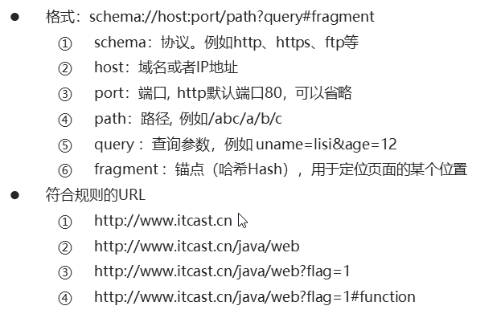

2. Restful形式的url

   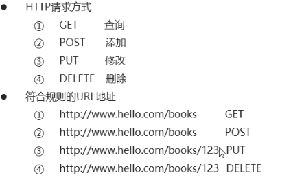

   - Restful是定义url的一种规则
   - 根据请求方式，来确定具体操作是增删改查哪种
   - 上图第一个url和第二个url是一样的，但是请求方式不一样
     - get代表获取图书列表
     - post代表新增图书数据，并且会通过请求体传递新增图书的数据
   - 上图第三个url代表要更新id为123的图书信息，更新的图书数据通过请求体传递
   - Restful形式的url，如果要通过url传递参数，不是？拼接，而是直接以/拼接即可
   - 目前公司内部使用Restful设计风格的url比较多

## 2. 异步用法

### 2.1异步调用

- 如果是要发起请求，访问接口获取数据，因为这个过程是比较耗时的，所以需要异步
- 异步：多个人同时处理多件事情
- 同步：一个人按照顺序依次处理多件事情

#### 2.1.1 异步效果分析（以下均是异步）

- 定时任务

- Ajax

- 事件函数

- 只要是回调函数就是异步：（**函数作为参数传递的都是回调函数**）

  - 事件函数代码：

    ```js
    xxx.addEventListener('click',function(){})
    xxx.onclick=function(){} // 即使这里的function不是回调函数，但也是异步
    ```

  - 定时任务代码：

    ```js
    setTimeout(function(){},10000)
    ```

- Ajax异步效果代码回顾：

```html
<body>
  <div>前后端交互</div>
  <script type="text/javascript" src="js/jquery.js"></script>
  <script type="text/javascript">
    /*
      前后端交互-异步编程
    */
    var ret = '---';
    $.ajax({
      url: 'http://localhost:3000/data',//接口返回HelloWorld
      success: function(data) {
        ret = data;
        console.log(ret)//这里可以拿到HelloWorld
      }
    });
    console.log(ret)//这里是没有办法拿到HelloWorld，因为ajax发起请求是异步的
    </script>
 <body>
```

- 运行node

  1. 安装NodeJS
  2. 进入素材，myapi
  3. 执行 npm i ，安装当前myapi项目所依赖的包
  4. node index.js
  5. 浏览器访问：http:///localhost:3000/data 
  6. 看到Hello World

- ​

  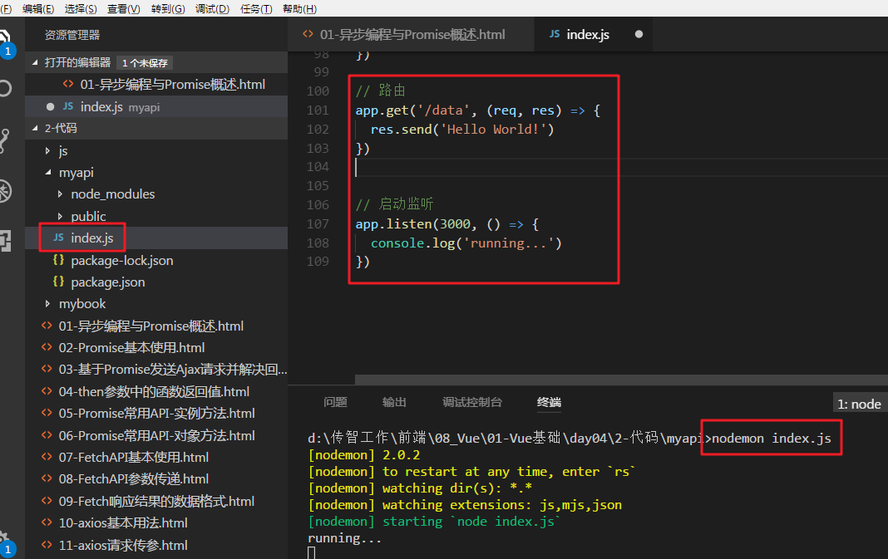

  - index.js中有/data路由，并且返回Hello World!数据
  - 服务运行在3000端口
  - 终端进入myapi目录之后，运行nodemon index.js
  - nodemon可以检测代码修改，自动重启服务

- 然后访问界面

  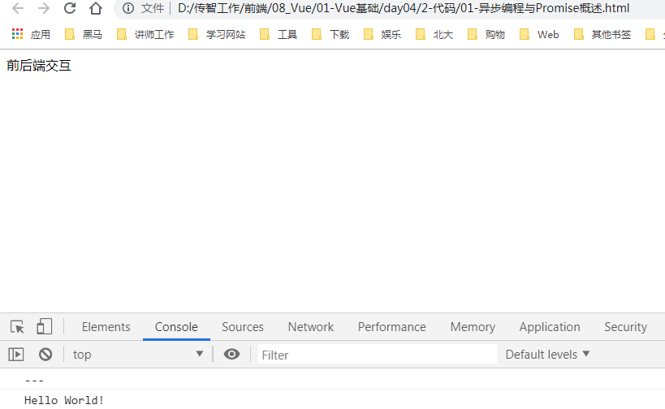

#### 2.1.2 多次异步调用的依赖分析

- 多次异步调用的结果顺序不确定

  - 代码回顾：发起三次请求，观察结果：

    ```js
    $.ajax({
         url: 'http://localhost:3000/data',
         success: function(data) {
             console.log(data)
         }
     });
    $.ajax({
        url: 'http://localhost:3000/data1',
        success: function(data) {
            console.log(data)
        }
    });
    $.ajax({
        url: 'http://localhost:3000/data2',
        success: function(data) {
            console.log(data)
        }
    });
    ```

  - 修改后台：增加data1和data2路由

  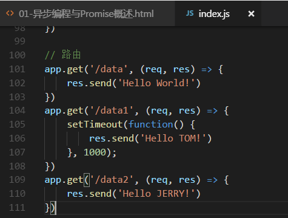

  - 效果

    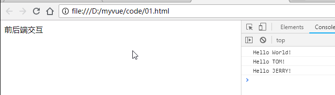

    - 这个打印的顺序不不固定的，而是根据网络状态而定
    - 虽然这次看到的结果，跟咱们发起请求的代码顺序一致，但是下次就可能不一定了

- 异步调用结果如果存在依赖需要嵌套

- 如果我们需要在data请求成功之后再请求data1，然后需要在data1请求成功之后再请求data2，代码如下：

  ```js
   $.ajax({
       url: 'http://localhost:3000/data',
       success: function(data) {
           console.log(data)
           $.ajax({
               url: 'http://localhost:3000/data1',
               success: function(data) {
                   console.log(data)
                   $.ajax({
                       url: 'http://localhost:3000/data2',
                       success: function(data) {
                           console.log(data)
                       }
                   });
               }
           });
       }
   });
  ```

  - 上述代码的层级太深，可读性比较糟糕
  - 我们后续通过async/await来解决

## 4. 接口调用-axios用法 ***

### 4.1 axios概述与基本用法

- 介绍：

  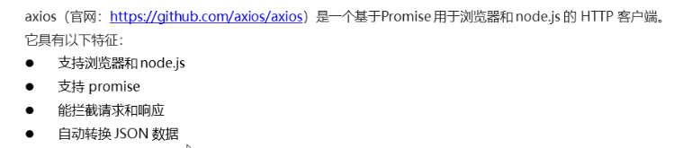

- 基本用法：

  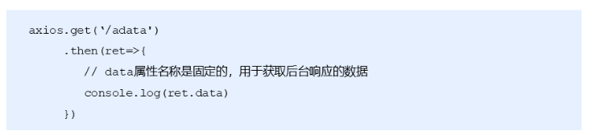

  - get方法是指发起get请求，
    - 参数：url
    - 返回一个包含了结果的Promise对象

- 代码：

  ```html
    <script type="text/javascript" src="js/axios.js"></script>
    <script type="text/javascript">
      axios.get('http://localhost:3000/adata').then(function(ret){
        // 注意data属性是固定的用法，用于获取后台的实际数据
        // console.log(ret.data)
        console.log(ret)
      })
    </script>
  ```

- 补充：ret是个axios封装的一个响应对象

  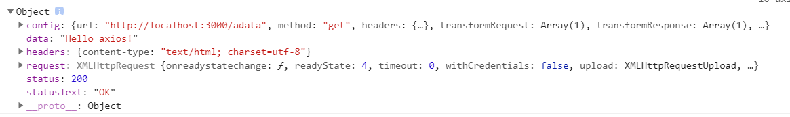

### 4.2 axios的GET和DELETE请求传参

- axios常用API

  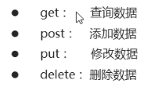

- GET请求传参，两种方式：

  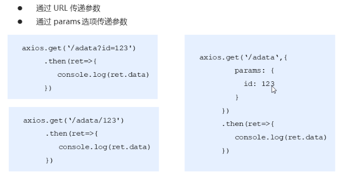

- DELETE请求传参也是两种方式：url或params

  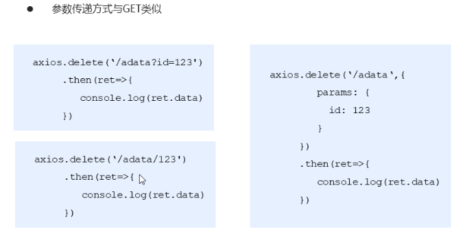

- 代码：

  ```html
  <script>
  # 1. 发送get 请求 
  	axios.get('http://localhost:3000/adata').then(function(ret){ 
        #  拿到 ret 是一个对象      所有的数据都存在 ret 的data 属性里面
        // 注意data属性是固定的用法，用于获取后台的实际数据
        // console.log(ret.data)
        console.log(ret)
      })
  	# 2.  get 请求传递参数
      # 2.1  通过传统的url  以 ? 的形式传递参数
  	axios.get('http://localhost:3000/axios?id=123').then(function(ret){
        console.log(ret.data)
      })
      # 2.2  restful 形式传递参数 
      axios.get('http://localhost:3000/axios/123').then(function(ret){
        console.log(ret.data)
      })
  	# 2.3  通过params  形式传递参数 
      axios.get('http://localhost:3000/axios', {
        params: {
          id: 789
        }
      }).then(function(ret){
        console.log(ret.data)
      })
  	#3 axios delete 请求传参     传参的形式和 get 请求一样
      axios.delete('http://localhost:3000/axios', {
        params: {
          id: 111
        }
      }).then(function(ret){
        console.log(ret.data)
      })
  </script> 
  ```


### 4.3 axios的POST和PUT请求传参

- post：

  - 以对象，key:value传参  （常用）

  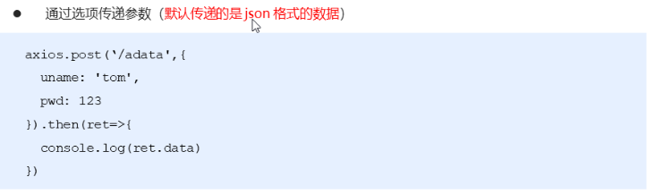

  - 以URLSearchParams传参

  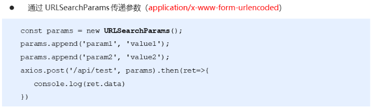

- put：

  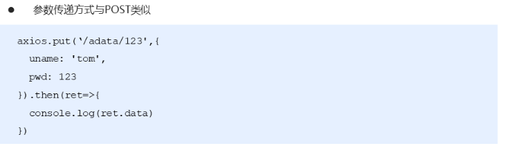

- 代码：

  ```html
  <script>
  # 4  axios 的 post 请求
      # 4.1  通过选项传递参数
      axios.post('http://localhost:3000/axios', {
        uname: 'lisi',
        pwd: 123
      }).then(function(ret){
        console.log(ret.data)
      })
  	# 4.2  通过 URLSearchParams  传递参数 
      var params = new URLSearchParams();
      params.append('uname', 'zhangsan');
      params.append('pwd', '111');
      axios.post('http://localhost:3000/axios', params).then(function(ret){
        console.log(ret.data)
      })

   	#5  axios put 请求传参   和 post 请求一样 
      axios.put('http://localhost:3000/axios/123', {
        uname: 'lisi',
        pwd: 123
      }).then(function(ret){
        console.log(ret.data)
      })
  </script>
  ```

### 4.4 axios响应结果和全局配置

- 响应结构的主要属性

  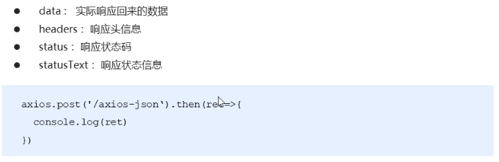

- 全局配置：

  ```js
  #  配置公共的请求头 
  axios.defaults.baseURL = 'https://api.example.com';
  #  配置 超时时间
  axios.defaults.timeout = 2500;
  #  配置公共的请求头
  axios.defaults.headers.common['Authorization'] = AUTH_TOKEN;
  # 配置公共的 post 的 Content-Type
  axios.defaults.headers.post['Content-Type'] = 'application/x-www-form-urlencoded';
  ```

- 代码：

  ```html
    <script type="text/javascript">
      /*
        axios 响应结果与全局配置
      */
      // axios.get('http://localhost:3000/axios-json').then(function(ret){
      //   console.log(ret.data.uname)
      // })

      // 配置请求的基准URL地址
      axios.defaults.baseURL = 'http://localhost:3000/';
      // 配置请求头信息
      axios.defaults.headers['mytoken'] = 'hello';
      axios.get('axios-json').then(function(ret){//axios-json自动拼接baseURL
        console.log(ret.data.uname)
      })

    </script>
  ```

- 总结：axios将服务器返回的json数据，直接转换为对应的对象data，我们直接从data可以获取对象中的内容

  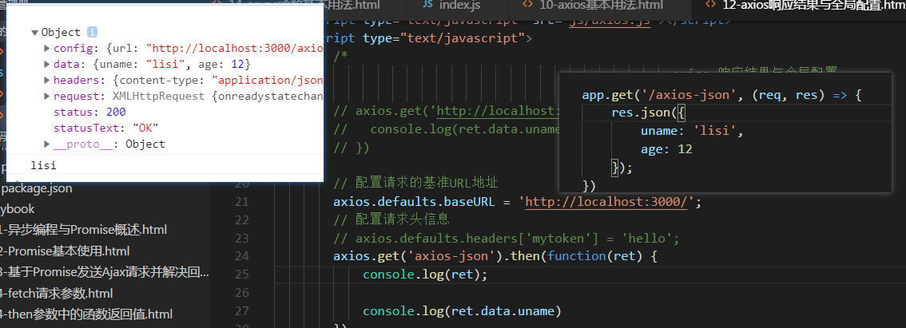

## 5. 接口调用-async/await用法 ***

### 5.1 async基本用法

- 多次异步顺序调用，出现了嵌套层级过深问题

- 那么接下来，我们来看一种新语法：async/await

- async/await用法介绍

  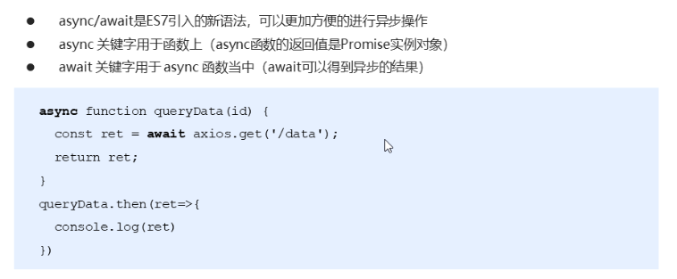

  - async作为一个关键字放到函数前面
    - 函数内部用到await，就必须给函数本身添加async

  - `await`关键字只能在使用`async`定义的函数中使用
    - await用于修饰，耗时操作，比如网络请求

      -  理解：await：等候，等着耗时操作完成，获取结果

    - await函数不能单独使用

    - 原本axios.get的结果需要then才能拿到

      ```js
      axios.get('adata').then(function(ret) {
          console.log(ret.data)//Hello axios!
      })
      ```

    - 现在直接使用await即可

       ```js
       async function queryData() {
           var ret = await axios.get('adata');
           console.log(ret.data);//Hello axios!
           return ret.data;
       }
       ```

  - 代码：

  ```js
  <body>
    <script type="text/javascript" src="js/axios.js"></script>
    <script type="text/javascript">
      /*
        async/await 处理异步操作：
        async函数返回一个Promise实例对象
        await后面可以直接跟一个 Promise实例对象
      */
      axios.defaults.baseURL = 'http:localhost:3000';
      //1. 普通的axios（需要then获取结果）
       axios.get('adata').then(function(ret){
         console.log(ret.data)
       })
  	//2. async+axios（不需要then直接可以await等待一会获取结果）
        async function queryData() {
          var ret = await axios.get('adata');//awiat可直接获取异步结果
          console.log(ret.data);
        }
  	 queryData();
  	
  	
    </script>
  </body>
  ```

### 5.2 处理多个异步请求

- 接下来我们来看一下经过async+await处理的多个请求，多么简单

- 介绍：

  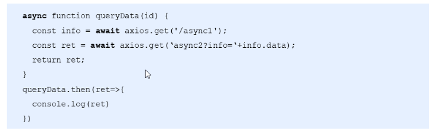

  - 因为await会等待每个请求的结果
  - 所以紧接着就可以发起第二个请求，因为想执行第二个请求，第一个请求肯定执行完了
  - 所以这里的async+await，是的异步代码看起来更像同步代码
  - **总结**：**async/await 让异步代码看起来、表现起来更像同步代码**

- 代码：

  ```js
  #2.  async    函数处理多个异步函数
  axios.defaults.baseURL = 'http://localhost:3000';

  async function queryData() {
      #2.1  添加await之后 当前的await 返回结果之后才会执行后面的代码   
      var info = await axios.get('async1');
      #2.2  让异步代码看起来、表现起来更像同步代码
      var ret = await axios.get('async2?info=' + info.data);
      return ret.data;
  }

  queryData().then(function(data){
      console.log(data)
  })
  ```


## 6. 基于接口的案例-图书列表案例

### 0. 业务需求

- 效果图：

  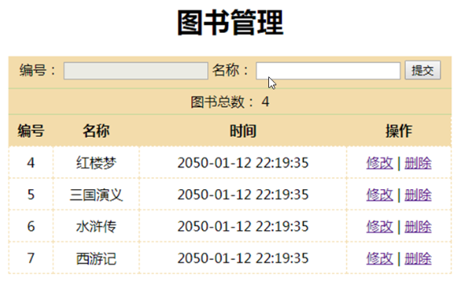

- 分析：

  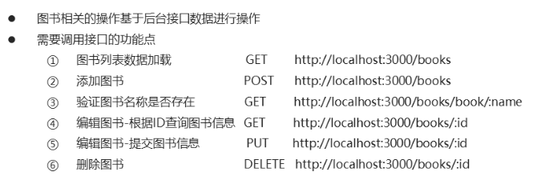

### 1. 基于接口案例-获取图书列表

- 文档：

  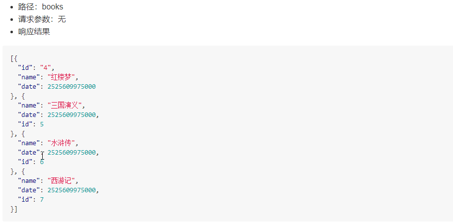

- 步骤：
  - 导入axios  用来发起请求
  - 把获取到的数据渲染到页面上 
- 代码：

```html
  <div id="app">
        <div class="grid">
            <table>
                <thead>
                    <tr>
                        <th>编号</th>
                        <th>名称</th>
                        <th>时间</th>
                        <th>操作</th>
                    </tr>
                </thead>
                <tbody>
                    <!-- 5.  把books  中的数据渲染到页面上   -->
                    <tr :key='item.id' v-for='item in books'>
                        <td>{{item.id}}</td>
                        <td>{{item.name}}</td>
                        <td>{{item.date }}</td>
                        <td>
                            <a href="">修改</a>
                            <span>|</span>
                            <a href="">删除</a>
                        </td>
                    </tr>
                </tbody>
            </table>
        </div>
    </div>
    <script type="text/javascript" src="js/vue.js"></script>
	# 1.  导入axios   
    <script type="text/javascript" src="js/axios.js"></script>
    <script type="text/javascript">
        /*
             图书管理-添加图书
         */
        # 2   配置公共的url地址  简化后面的调用方式
        axios.defaults.baseURL = 'http://localhost:3000/';
        axios.interceptors.response.use(function(res) {
            return res.data;
        }, function(error) {
            console.log(error)
        });

        var vm = new Vue({
            el: '#app',
            data: {
                flag: false,
                submitFlag: false,
                id: '',
                name: '',
                books: []
            },
            methods: {
                # 3 定义一个方法 用来发送 ajax 
                # 3.1  使用 async  来 让异步的代码  以同步的形式书写 
                queryData: async function() {
                    // 调用后台接口获取图书列表数据
                    // var ret = await axios.get('books');
                    // this.books = ret.data;
					# 3.2  发送ajax请求  把拿到的数据放在books 里面   
                    this.books = await axios.get('books');
                }
            },

            mounted: function() {
				#  4 mounted  里面 DOM已经加载完毕  在这里调用函数  
                this.queryData();
            }
        });
    </script>
```

### 2.  添加图书

- 文档：

  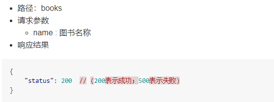

- 步骤：
  - 获取用户输入的数据   发送到后台
  - 渲染最新的数据到页面上

- 代码：

```js
 methods: {
    handle: async function(){
          if(this.flag) {
            // 编辑图书
            // 就是根据当前的ID去更新数组中对应的数据
            this.books.some((item) => {
              if(item.id == this.id) {
                item.name = this.name;
                // 完成更新操作之后，需要终止循环
                return true;
              }
            });
            this.flag = false;
          }else{
            # 1.1  在前面封装好的 handle 方法中  发送ajax请求  
            # 1.2  使用async  和 await 简化操作 需要在 function 前面添加 async   
            var ret = await axios.post('books', {
              name: this.name
            })
            # 1.3  根据后台返回的状态码判断是否加载数据 
            if(ret.status == 200) {
             # 1.4  调用 queryData 这个方法  渲染最新的数据 
              this.queryData();
            }
          }
          // 清空表单
          this.id = '';
          this.name = '';
        },        
 }         
```

### 3.  验证图书名称是否存在

- 文档：

  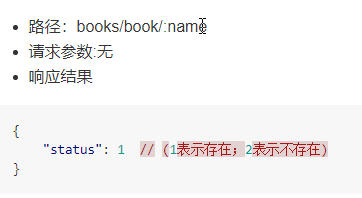

- 步骤：
  - 添加图书之前发送请求验证图示是否已经存在
  - 如果不存在 往后台里面添加图书名称
    - 图书存在与否只需要修改submitFlag的值即可

- 代码：

```js
 watch: {
        name: async function(val) {
          // 验证图书名称是否已经存在
          // var flag = this.books.some(function(item){
          //   return item.name == val;
          // });
          var ret = await axios.get('/books/book/' + this.name);
          if(ret.status == 1) {
            // 图书名称存在
            this.submitFlag = true;
          }else{
            // 图书名称不存在
            this.submitFlag = false;
          }
        }
},
```

### 4.  编辑图书

- 文档：

  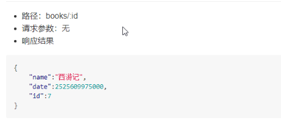

- 步骤：
  - 根据当前书的id 查询需要编辑的书籍
  - 需要根据状态位判断是添加还是编辑 

- 代码：

```js
 methods: {
        handle: async function(){
          if(this.flag) {
            #4.3 编辑图书   把用户输入的信息提交到后台
            var ret = await axios.put('books/' + this.id, {
              name: this.name
            });
            if(ret.status == 200){
              #4.4  完成添加后 重新加载列表数据
              this.queryData();
            }
            this.flag = false;
          }else{
            // 添加图书
            var ret = await axios.post('books', {
              name: this.name
            })
            if(ret.status == 200) {
              // 重新加载列表数据
              this.queryData();
            }
          }
          // 清空表单
          this.id = '';
          this.name = '';
        },
        toEdit: async function(id){
          #4.1  flag状态位用于区分编辑和添加操作
          this.flag = true;
          #4.2  根据id查询出对应的图书信息  页面中可以加载出来最新的信息
          # 调用接口发送ajax 请求  
          var ret = await axios.get('books/' + id);
          this.id = ret.id;
          this.name = ret.name;
        },
```

###   5. 删除图书

- 文档：

  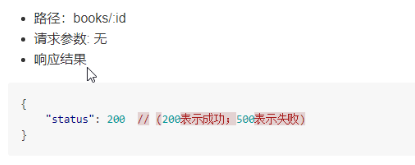

- 步骤：
  - 把需要删除的id书籍 通过参数的形式传递到后台

- 代码：

```js
   deleteBook: async function(id){
          // 删除图书
          var ret = await axios.delete('books/' + id);
          if(ret.status == 200) {
            // 重新加载列表数据
            this.queryData();
          }
   }
```

